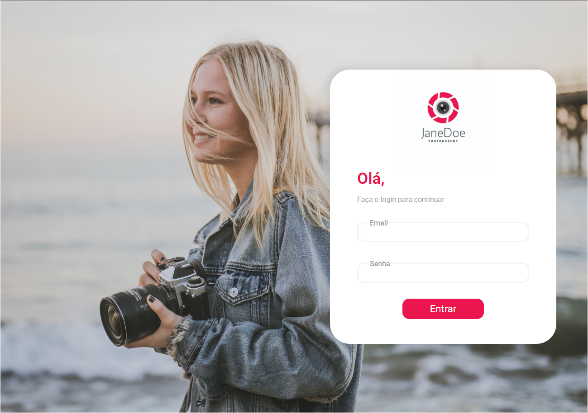
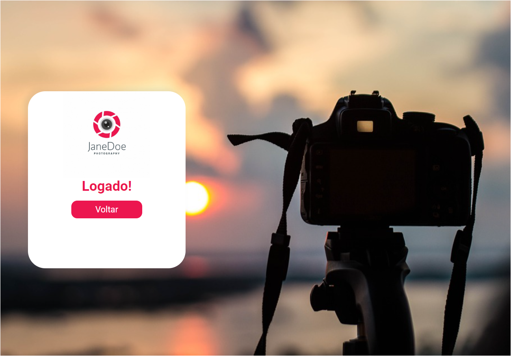

<h1 align="center">LoginPage photography</h1>

 Um login screen com tema dark 
 

## Indice

- <a href="#funcionalidades-do-projeto">funcionalidades do projeto</a>
- <a href="#como-rodar">link do site</a>
- <a href="#tecnologias-ultilizadas">Tecnologias utilizadas</a>
- <a href="#pessoas-autoras">Pessoas autoras</a>
- <a href="#proximos-passos">Próximos passos</a>

<h2 id="funcionalidades-do-projeto">Funcionalidades</h2>

- [x] logar com email e senha predefinido
- [x] passagem entre telas

<h2 id="como-rodar">Como rodar o projeto</h2>
<a href="https://vigorous-nobel-529923.netlify.app">Ver site clicando aqui</a>

<h2 id="tecnologias-ultilizadas">Tecnologias utilizadas</h2> 

- [React](https://react.dev/)

<h2 id="pessoas-autoras">Pessoas autoras</h2> 

welder barroso

<h2 id="proximos-passos">Próximos passos</h2> 

- [ ] deixar login funcional
